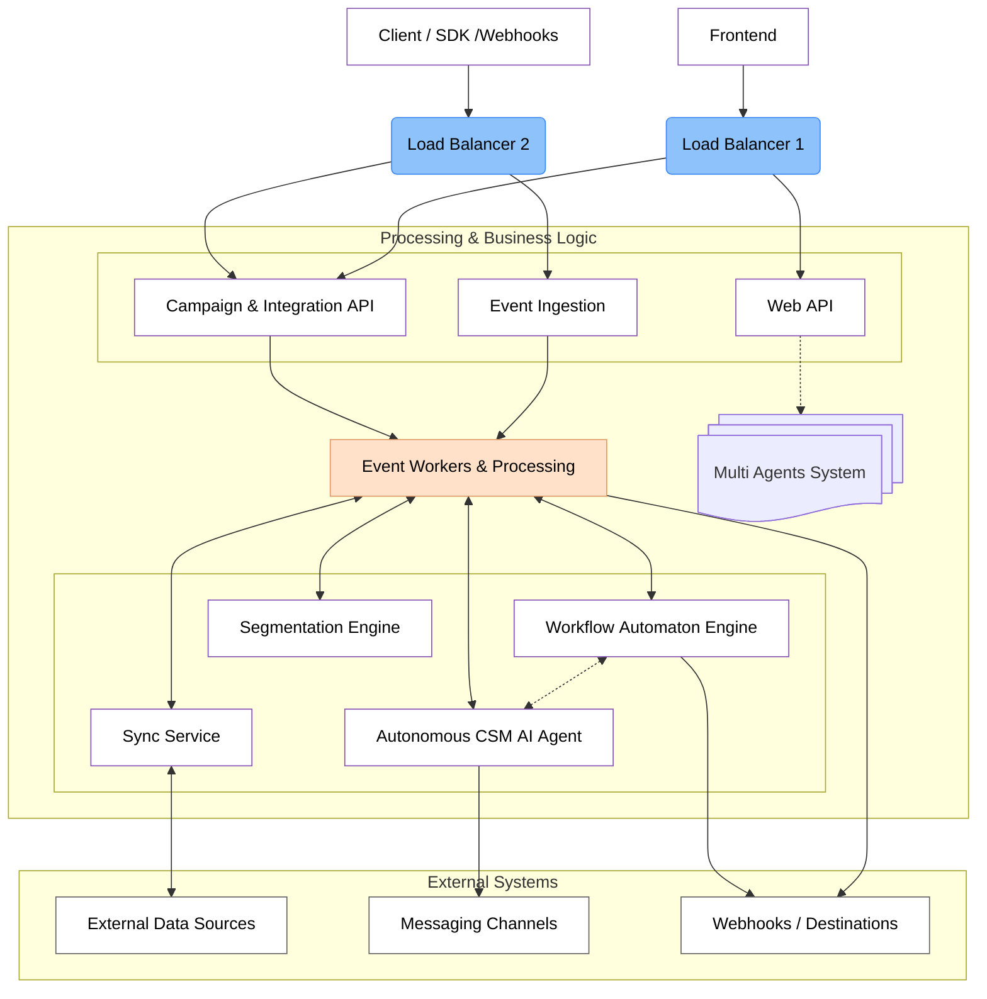

# Introduction

Welcome to Influentia's technical documentation. This guide introduces the architecture and components needed to build
an autonomous customer success system capable of providing personalized 1:1 experiences at scale.

Influentia represents a fundamental shift in how companies approach customer success. Instead of forcing human teams to
scale linearly with customer growth or relying on rigid, static automation flows, we're building a system that can
autonomously manage customer relationships by understanding individual context, behavior, and needs.

## The Problem: Current Solutions Don't Scale

Customer success as a function faces a scaling problem:

- **Human-only approaches** create incredible experiences but can't scale beyond the team's capacity
- **Static automation flows** can reach everyone but deliver impersonal, one-size-fits-all experiences
- **Basic AI tools** can generate content but lack the intelligence to build genuine relationships

Current solutions force a choice between quality and scale. Influentia eliminates this false dichotomy.

## From Static Journeys to ZeroFlow™

Current SaaS customer engagement relies on predefined journeys:

1. Your CS team defines segments based on simple criteria
2. They build linear flows with basic branching logic
3. Everyone in a segment gets the same sequence, regardless of individual context
4. Changes require manual rebuilding of entire journeys

We call this approach **Static Flows** - it doesn't adapt to individual user signals, requires constant maintenance, and
quickly becomes untenable as your customer base grows.

Influentia introduces **ZeroFlow™** - purpose-built for SaaS startups to:

- Require minimal setup - define goals, not complex automation rules
- Scale your existing CS team's expertise to your entire customer base
- Improve key SaaS metrics (activation, retention, expansion revenue)
- Eliminate the "big customers get humans, small customers get robots" divide
- Adapt automatically to product changes without rebuilding automations

## Modular Architecture: Building Blocks of Autonomous Customer Success

Influentia's architecture is designed as a composable system with specialized components that work together to create
intelligent, adaptive customer success automation:

### Key Components

1. **Event Ingestion & Processing (Capture API)** - Connects to your product to capture user behaviors without requiring
   engineering team bandwidth.

2. **Data Synchronization (Sync Service)** - Integrates with your SaaS stack (Stripe, Salesforce, Hubspot) to create a
   complete view of customers without data warehouse complexity.

3. **Workflow Automation Engine** - Powers automated, multi-step journeys for onboarding, renewal, expansion, and
   retention campaigns that work in parallel with ZeroFlow.

4. **Segmentation Engine** - Creates dynamic user groups across product usage, billing, and engagement data to identify
   opportunities and risks.

5. **Autonomous CSM AI Agent (ZeroFlow)** - The intelligent core that scales your best CSM's knowledge and makes
   autonomous decisions about when, how, and what to communicate to each individual user.

6. **Event Workers & Task Queue** - The operational backbone ensuring reliable execution of time-based and event-driven
   processes.

7. **Data Stores & Infrastructure** - The persistence layer supporting real-time decisions and historical analysis.

## Built for SaaS KPIs

Influentia directly impacts your key metrics:

1. **Improved Activation Rate**: Personalized onboarding that adapts to each user's progress and behavior, not a fixed
   sequence.

2. **Reduced Churn**: Early risk detection and automated intervention when usage patterns indicate potential churn.

3. **Increased Expansion Revenue**: Proactive feature education and upgrade opportunities when usage patterns suggest
   readiness.

4. **Consistent Experience Across Tiers**: Enterprise-grade support experience for every customer, regardless of
   contract size.

## What's Next in This Documentation

In the following sections, we'll dive deeper into each component of Influentia's architecture:

- [Event Ingestion & Processing (Capture API)](/coming-soon)
- [Data Synchronization (Sync Service)](/coming-soon)
- [Workflow Automation Engine](/coming-soon)
- [Segmentation Engine](/coming-soon)
- [ZeroFlow AI Architecture](/coming-soon)
- [Event Workers & Task Processing](/coming-soon)
- [Data Modeling & Infrastructure](/coming-soon)

Each section will explore the component's purpose, architecture, implementation considerations, and how it integrates
with the broader system.

Whether you're considering Influentia for your customer engagement needs or you're a technical founder interested in
this space, this documentation serves a dual purpose. For potential customers, we're providing unprecedented
transparency into the thought process and architecture behind our platform - because we believe you should understand
the systems you depend on. For technical founders and builders, we're opening our blueprint as an invitation to
contribute, learn alongside us, and perhaps even collaborate as we chart this new territory in autonomous customer
success. This isn't just documentation; it's the beginning of a community around a shared vision for what customer
engagement can become.
