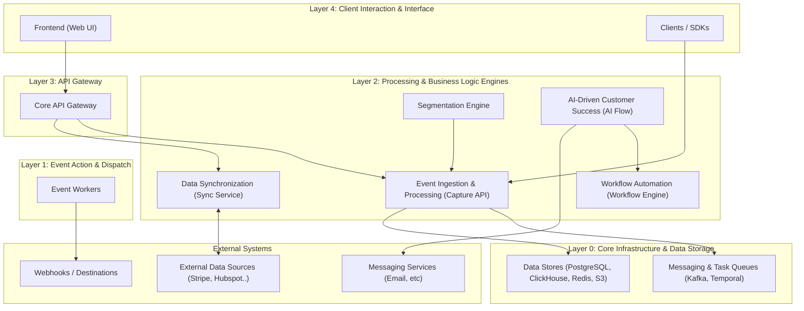

# Influentia: The Autonomous CSM for Growing SaaS

Building a scalable customer success function that grows with your startup, not your headcount

## Introduction

Welcome to Influentia's technical documentation. If you're a SaaS founder or early employee struggling to scale customer
success without adding headcount, you're in the right place. This guide introduces the architecture behind an autonomous
customer success system that delivers personalized experiences at scale.

Influentia addresses the critical scaling challenge every successful SaaS faces: how to provide high-touch customer
success to all users when you can't hire fast enough or dedicate CSMs to every account.

## The SaaS Scaling Problem

As your startup gains traction, customer success becomes a critical bottleneck:

- **Pre-seed/Seed stage**: Founders personally handle customer success, creating amazing experiences but consuming
  valuable time
- **Early growth**: Your first CS hire can only handle 50-100 accounts, forcing you to segment by ARR and neglect
  smaller accounts
- **Scale-up phase**: Even with automation tools, you're stuck building rigid journeys that treat similar users
  identically
- **Expansion stage**: Your CS:Customer ratio becomes increasingly expensive as you scale, eating into margins

The common solution—automation tools like Customer.io, Intercom, or Vitally—creates efficiency but sacrifices the
personal touch that drove your early success.

## From Static Journeys to ZeroFlow™

Current SaaS customer engagement relies on predefined journeys:

1. Your CS team defines segments based on simple criteria
2. They build linear flows with basic branching logic
3. Everyone in a segment gets the same sequence, regardless of individual context
4. Changes require manual rebuilding of entire journeys

We call this approach **Static Flows** - it doesn't adapt to individual user signals, requires constant maintenance, and
quickly becomes untenable as your customer base grows.

Influentia introduces **ZeroFlow™** - purpose-built for SaaS startups to:

- Require minimal setup - define goals, not complex automation rules
- Scale your existing CS team's expertise to your entire customer base
- Improve key SaaS metrics (activation, retention, expansion revenue)
- Eliminate the "big customers get humans, small customers get robots" divide
- Adapt automatically to product changes without rebuilding automations

## Modular Architecture for Resource-Constrained Teams

Influentia's architecture is designed to grow with your startup through a modular approach that integrates with your
existing stack:

### Key Components for SaaS Founders

1. **Event Ingestion & Processing (Capture API)** - Connects to your product to capture user behaviors without requiring
   engineering team bandwidth.

2. **Data Synchronization (Sync Service)** - Integrates with your SaaS stack (Stripe, Salesforce, Hubspot) to create a
   complete view of customers without data warehouse complexity.

3. **Workflow Automation Engine** - Powers automated, multi-step journeys for onboarding, renewal, expansion, and
   retention campaigns that work in parallel with ZeroFlow.

4. **Segmentation Engine** - Creates dynamic user groups across product usage, billing, and engagement data to identify
   opportunities and risks.

5. **AI-Driven Customer Success (ZeroFlow)** - The intelligent core that scales your best CSM's knowledge across your
   entire customer base.

6. **Event Workers & Task Queue** - Ensures reliable execution of time-sensitive communications without adding
   infrastructure complexity.

7. **Data Stores & Infrastructure** - Provides the foundation for data-driven decisions with minimal management
   overhead.

## Built for SaaS KPIs

Influentia directly impacts your key metrics:

1. **Improved Activation Rate**: Personalized onboarding that adapts to each user's progress and behavior, not a fixed
   sequence.

2. **Reduced Churn**: Early risk detection and automated intervention when usage patterns indicate potential churn.

3. **Increased Expansion Revenue**: Proactive feature education and upgrade opportunities when usage patterns suggest
   readiness.

4. **Consistent Experience Across Tiers**: Enterprise-grade support experience for every customer, regardless of
   contract size.

5. **Improved CS Team Efficiency**: Your human CS team focuses on high-value interactions while automation handles
   routine engagement.

## Progressive Implementation for Growing Startups

In the following sections, we'll show how to implement each component based on your startup stage:

- [Event Ingestion & Processing (Capture API)](./capture-api.md) - Start capturing product usage without complex data
  infrastructure
- [Data Synchronization (Sync Service)](./sync-service.md) - Connect your billing, CRM, and support systems
- [Workflow Automation Engine](./workflow-engine.md) - Build your first automated customer journeys
- [Segmentation Engine](./segmentation-engine.md) - Create dynamic user segments that update in real-time
- [ZeroFlow AI Architecture](./zeroflow.md) - Deploy autonomous customer success at scale
- [Event Workers & Task Processing](./event-workers.md) - Ensure reliable execution of customer communications
- [Data Modeling & Infrastructure](./data-infrastructure.md) - Scale your data foundation as you grow

Each section is designed to provide practical implementation guidance for technical founders and early engineering
teams, with consideration for the resource constraints typical at each funding stage.

Whether you're building in-house or considering Influentia as your customer success platform, this documentation
provides the architectural blueprint for truly scalable, personalized customer engagement that grows with your SaaS
business.